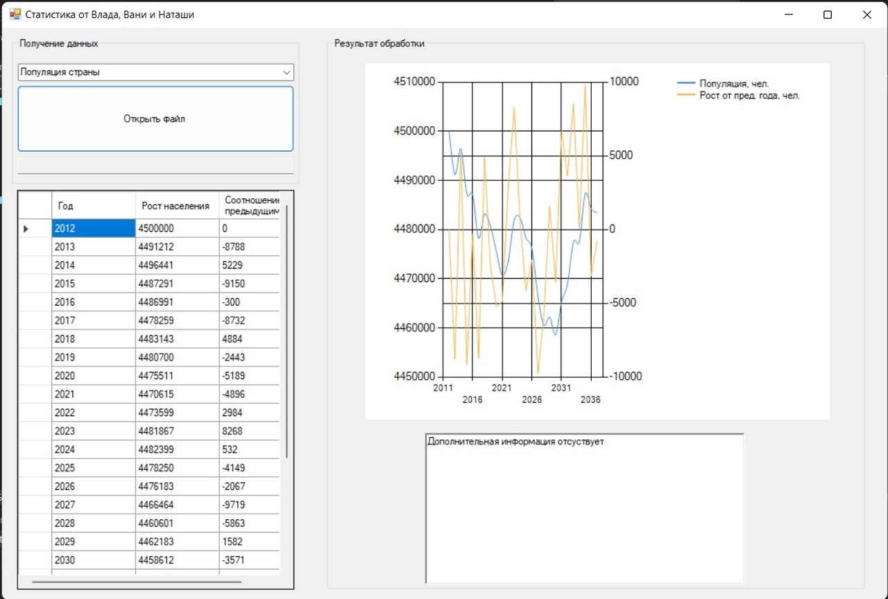

# Технологии программирования. **3-я лаба**

Участники: Воробьев В.А.

## Функционал команд

### Численость населения РФ

- **Задание:** Пользователь открывает файл с данными о миграции населения России за последние 15 лет (число иммигрантов и число эмигрантов). Вывести эту информацию на экран в удобном формате. Также по этим данным построить графики. Вычислить ежегодный процент изменения миграции.

- **Формат входных данных:** ```год; население```
    
  	> *Пример:*
	>
  	> 2012;4500000
	>
	> 2013;4491212
	> 
	> ...

- **Пример работы:**

	